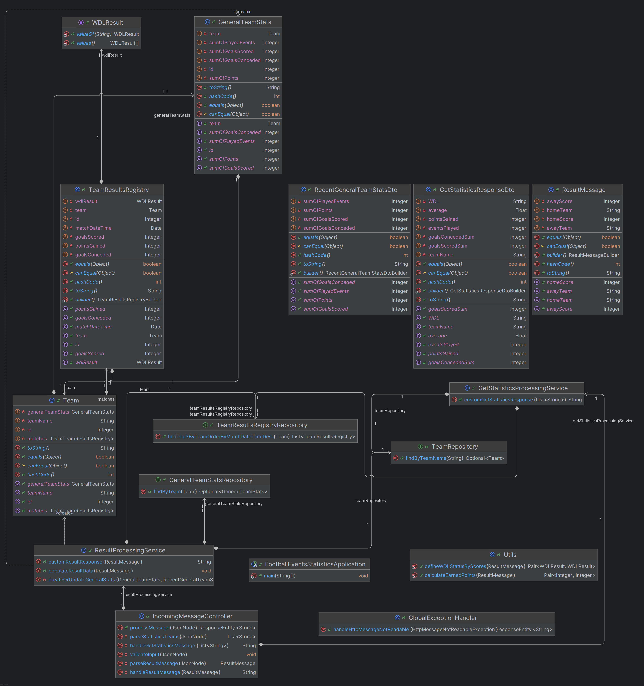

# Football Events Statistics

## Overview

FootballEventsStatistics is a Java-based application designed to process and analyze football event data. It provides functionalities to handle incoming messages from two services: Events Result Service and Statistics Service.

## Features

The application stores information about general team statistics that contain number of played events, sum of gained points, sum of goals scored, sum of goals conceded. It also produces statistics that contain information about the latest 3 team's results.

## Prerequisites

Before running the application, ensure you have the following installed:

- **Java Development Kit (JDK) 17:** The application is built using Java 17.
- **Framework:** Spring Boot v3.4.1
- **Maven:** Used for managing dependencies and building the project.
- **Database system:** PostgreSQL 17.2

## Communication
The communication with the application is conducted via REST API. The application exposes endpoint of following parameters:
- **`/message`**: Manage incoming message.
  - **Method**: POST
  - **Content-Type**: JSON
  - **Body**: raw
  - **Response**: Text message adequate to the incoming message type.

This endpoint consumes two types of JSON messages:
  - **Events Result Service** sends a message whenever a football event is finished. The message is sent as JSON and contains following fields: <br/>
  type = "RESULT" <br/>
  result - value of the result message <br/>
 &emsp;   home_team - name of the home team e.g. Bayern <br/>
 &emsp;   away_team - name of the away team e.g. Barcelona <br/>
 &emsp;   home_score - amount of goals scored by home team <br/>
 &emsp;   away_score - amount of goals scored by away team <br/>
 
Example:
```json
{
  "type":"RESULT",
  "result": {
    "home_team":"Bayern",
    "away_team":"Barcelona",
    "home_score":2,
    "away_score":0
    }
}
```
On a RESULT message it produces the simplified statistics information for both teams: number of played events, sum of gained points, sum of goals scored, sum of goals conceded.
The produced response looks as follows:
```
Bayern 1 3 3 0
Barcelona 1 0 0 3
```
<br/>

  - **Statistics Service** sends an request for retrieving a specified team statistics. The message is sent as JSON and contains following fields: <br/>
  type = "GET_STATISTICS" <br/>
  get_statistics - value of the get_statistics message
&emsp;  teams - teams list, for which the request is sent e.g. ["Bayern", "Barcelona"] <br/>
 
Example:
```json
{
  "type":"GET_STATISTICS",
  "get_statistics": {
    "teams": ["Bayern", "Barcelona"]
  }
}
```
On a GET_STATISTICS message, it produces statistics information for the team. The statistics contain information about the latest 3 team's results: form (text with letters W-win, D-draw, L-lose) e.g. WDL, average amount of goals in the team events (sum of scored and conceded divided by amount of events attended), number of played events, sum of gained points, sum of goals scored, sum of goals conceded.
The produced response looks as follows:
```
Bayern WLD 3.67 3 4 6 5
Barcelona L 3.0 1 0 0 3
```

### Error reporting
- Requests lacking type field will be reported as: `"Invalid message: Missing 'type' field."`
- Malformed JSONs will be reported as: `Malformed JSON request: (...)`

"result" message type:
- Non-integer values provided in JSON will be indicated with message: `'home_score' and 'away_score' must be integers.`

"get_statistics" message type:
- For team names not provided in array: `'teams' must be an array.`
- For empty team array: `Empty 'teams' array provided.`

For unknown message type (in field 'type'): `Unsupported message type: (...)`

## Configuration

For proper operation, adjusting following settings in `application.properties` is required:
- `spring.datasource.url` – database address,
- `spring.datasource.username` – database user name,
- `spring.datasource.password` – database user password

## Database Schema


## Class Diagram

---
*Note: 
Running in IntelliJIDEA might require 'Enabling annotation processing'.
Builder, Getters, Setters methods from Lombok might induce an error while building the project in IntelliJ IDEA 2024.3.1.
Fix: change in File->Settings->Build, Execution, Deployment->Compiler->Annotation Processors, 
Choose FootballEventsStatistics project and with enabled "Enable annotation processing" choose option "Obtain processors from project classpath".